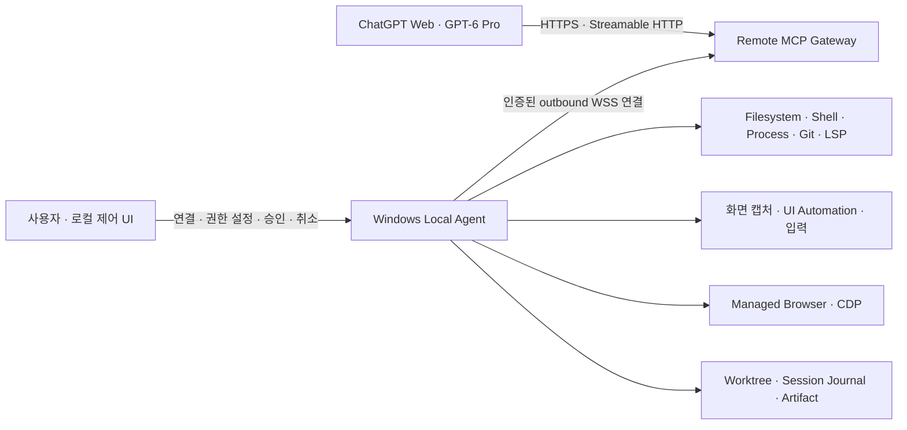

# CODEXish MCP for Pro

## 최상위 설계 원칙: 사용자 입력 한 번에서 최대한 많은 작업을 완수한다

**이 프로젝트의 최상위 제품 가정은 “ChatGPT 공홈 Chat의 6 Pro는 토큰제 할당량이 아니라 사용자 입력 횟수제 할당량을 사용한다”는 것이다. 따라서 한 번의 사용자 입력 안에서 가능한 한 많은 도구 호출·관찰·수정·실행·테스트·재수정 반복을 수행하여, Codex에 가까운 장시간 작업 루프를 구성한다.**

이는 사용자가 지정한 **설계 전제**다. 구체적인 입력 한도, 초기화 주기, 도구 호출의 과금·집계 방식, 비공개 정책을 확인된 사실로 단정하지 않는다. 무제한 실행이나 한 턴의 지속 시간을 보장하지 않으며, 목표는 불필요한 호출 수 증가가 아니라 **추가 사용자 입력 없이 완료하는 유효 작업량**이다. 근거와 검증 항목은 [제품 가정과 호환성](docs/product-assumptions.md)에 기록한다.

토큰과 출력 크기는 여전히 문맥 유지·지연·신뢰성에 영향을 준다. 큰 결과는 검색 가능한 artifact로 보존하고, 모델에는 다음 판단에 필요한 관찰을 전달한다.

## 무엇을 만드는가

ChatGPT의 일반 Chat에서 사용하는 GPT-6 Pro에 Windows PC의 개발·앱 조작 도구를 제공하는 MCP 시스템을 설계한다. 공개 기술로 로컬 작업의 기본 기능을 구현하고, 모델이 결과를 관찰하며 다음 행동을 결정하도록 한다.

```text
사용자 입력 한 번
  → 작업 범위와 완료 조건 파악
  → 관찰 → 판단 → 파일/셸/브라우저/GUI 작업
               ↑              ↓
               └── 검증·오류 수정
  → 결과와 근거 보고
```

**현재 상태: 설계 문서만 있는 저장소다.** 실행 가능한 MCP 서버, Windows Agent, 설치 프로그램, 테스트 구현은 아직 없다. 아래 도구명과 데이터 구조는 구현을 위한 제안 계약이며 Codex 내부 API가 아니다.

## 아키텍처 요약



Local Agent가 Gateway로 연결하고 그 연결에서 양방향 요청·결과를 전달한다. PC의 공개 수신 포트를 필수로 요구하지 않는다. Gateway는 인증·라우팅·MCP 변환을, Agent는 실제 실행과 최종 권한 검사를 맡는다.

장기 프로세스는 실행 핸들을 즉시 돌려주고 이후 상태·증분 출력을 조회한다. Chat 턴이 끝나도 허가된 프로세스와 journal은 유지할 수 있지만, **MCP 서버가 Chat의 추론을 계속시키거나 새 사용자 메시지를 만들어낼 수 있다고 가정하지 않는다.**

## 권한 프로필

| 프로필 | 목적 | 대표 기능 |
| --- | --- | --- |
| `READ_ONLY` | 허용된 대상 관찰 | 파일·검색·Git 조회·프로세스 조회·화면/UIA·이미 연결된 브라우저의 관찰 |
| `FULL_CONTROL` | 허가된 범위에서 작업 수행 | 파일 편집·셸·프로세스·Git 변경·브라우저·데스크톱 입력 |

프로필은 요금제 이름과 독립적이다. 현재 공식 Developer mode 문서는 Pro를 포함한 계정에서 읽기·쓰기 MCP 지원을 안내한다. 실제 대상 계정과 **6 Pro 선택 상태**에서의 도구 호출·이미지 전달·승인·연속 호출은 별도로 검증해야 한다. [OpenAI Developer mode](https://developers.openai.com/api/docs/guides/developer-mode)

`FULL_CONTROL`도 사용자가 설정한 기기·workspace·앱·외부 전송 범위를 따른다. 이미 허가된 작업은 반복 확인으로 끊지 않고, 추가 권한이 필요한 행동은 구체적인 대상과 효과를 보여준다.

## 문서 안내

| 문서 | 다루는 내용 |
| --- | --- |
| [아키텍처](docs/architecture.md) | 구성요소, 권한 교집합, 장기 실행, 동시 작업, worktree, journal, 복구 |
| [요구사항과 수용 기준](docs/requirements.md) | 구현 순서, 기능 요구사항, 실제 사용자 흐름 검증, 완료 기준 |
| [도구 계약](docs/tool-contracts.md) | filesystem/shell/process/git/computer-use/browser-CDP/LSP/artifact/세션 API와 오류 모델 |
| [승인과 보안](docs/security.md) | 인증, 기기 연결, 권한 지속성, 실제 격리 경계, 비밀정보, 신뢰할 수 없는 콘텐츠 |
| [제품 가정과 호환성](docs/product-assumptions.md) | 공식 근거, 미확인 사항, 이전 설계 정정, 실계정 확인표 |

## 첫 구현의 성공 조건

사용자가 작업을 지시하면 모델이 workspace를 읽고, 파일을 수정하고, 테스트 실패를 관찰한 뒤 수정·재검증하고, 필요하면 브라우저나 Windows 앱으로 결과를 확인한다. 진행 중인 작업과 모든 결과는 다시 조회할 수 있고, 최종 diff와 실제 검증 결과로 완료를 설명한다.

이를 위해 일반적인 작업 중 충돌은 큐·진행 중 작업 합류·파일 변경 감지로 처리한다. 다른 작업이 실행 중이라는 이유만으로 유효 요청을 거절하는 `busy`/`already_running` 장벽을 도입하지 않는다. 작업 전체의 임의 시간·호출 횟수 제한도 설계에 넣지 않는다. 실제 환경의 제한이 있다면 출처와 영향을 표시한다.

Codex와 유사한 실행 기능을 목표로 하되 Codex의 시스템 프롬프트, 내부 도구 구현, 사용량 집계, 자동 지속 실행, UI가 그대로 제공된다고 주장하지 않는다. MVP와 후속 기능의 경계는 [요구사항](docs/requirements.md)에 정의한다.
