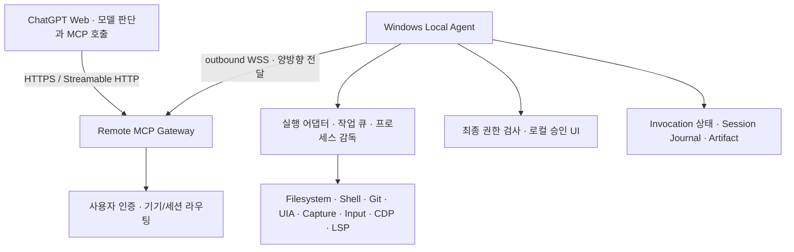
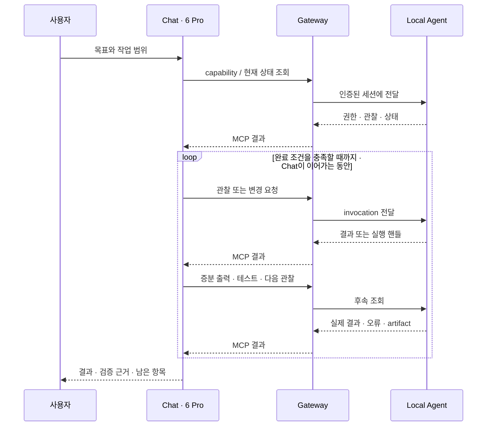

# 아키텍처

## 최상위 설계 원칙

**“ChatGPT 공홈 Chat의 6 Pro는 토큰제 할당량이 아니라 사용자 입력 횟수제 할당량을 사용한다”는 사용자 제공 제품 가정을 최우선으로 둔다. 한 번의 사용자 입력 안에서 가능한 한 많은 도구 호출·관찰·수정·실행·테스트 반복을 수행하여 Codex에 가까운 장시간 작업 루프를 구성한다.** 구체적인 집계 규칙·한도·한 턴의 지속 시간은 보장하지 않는다. [근거와 미확인 사항](product-assumptions.md)

따라서 도구는 다음 판단에 필요한 결과와 후속 조회 방법을 반환해야 한다. 작업을 시작하고 사용자가 다시 물을 때까지 방치하는 구조, 전송 요청이 끝났다고 프로세스를 죽이는 구조, 같은 권한을 매번 확인하는 구조를 기본 경로로 삼지 않는다.

## 1. 구성과 책임



| 구성요소 | 책임 | 경계 |
| --- | --- | --- |
| ChatGPT Web / 6 Pro | 사용자 목표 해석, 도구 선택, 관찰에 따른 재계획, 완료 보고 | 턴·모델·도구 사용 정책은 ChatGPT가 관리한다. |
| Remote MCP Gateway | MCP 초기화·도구 목록·호출, 사용자 인증, 기기 연결, 라우팅, 전달 상태 | 호스팅 서버에서 사용자 PC용 명령을 실행하지 않는다. |
| Windows Local Agent | 파일·프로세스·앱 실행, 실행 직전 권한 검증, 결과 수집, 취소·복구 | 기기 실행의 권위 있는 상태를 보유한다. |
| 로컬 제어 UI | 기기 연결 확인, workspace·앱 허가, 필요한 승인, 진행 상황·중단 | 모델이 승인 결정을 작성할 수 없는 신뢰 경로다. |
| 저장 계층 | 실행 상태, journal, 제한된 감사 기록, 결과 artifact | Gateway 전달 확인과 Agent 실행 완료를 구분한다. |

Windows의 대화형 데스크톱에 접근하는 helper는 로그인한 사용자 세션에서 동작하도록 설계한다. 백그라운드 서비스와 분리할 경우 인증된 로컬 IPC를 사용한다. 서비스가 설치됐다는 이유만으로 잠금 화면·보안 데스크톱·모든 관리자 창에 접근할 수 있다고 가정하지 않는다.

### 공개 구현 기반과 스택 후보

Gateway는 TypeScript/Node.js와 MCP SDK, Windows Agent는 C#/.NET 및 Win32 연동을 우선 검토한다. 이는 추천 스택이며 패키지 버전·프레임워크·DB·설치 방식을 확정한 구현은 아니다. 영속 저장소는 아래 crash recovery 계약을 충족해야 하고, Redis 같은 보조 서비스는 필요한 근거가 생길 때 선택한다.

어댑터 경계는 filesystem, process/ConPTY, Git/worktree, UI Automation, 화면 캡처, SendInput, browser/CDP, LSP로 나눈다. Windows Graphics Capture 또는 Desktop Duplication을 캡처 후보로 둔다. 브라우저는 전용 프로필과 Playwright/CDP를 검토한다.

Codex에 노출된 파일 편집·터미널·브라우저·관찰 기능은 기능 요구사항의 참고점이다. 이 프로젝트가 Codex의 번들·세션·비공개 도구를 재사용할 권한이나 지원 API를 가진다고 가정하지 않는다. Apps SDK의 시각적 컴포넌트는 선택 사항이며, 기본 동작은 도구 호출·텍스트·이미지 결과로 가능해야 한다.

## 2. 연결과 인증 경로

1. 사용자가 Local Agent를 기기에 설치하고 로컬 UI에서 연결할 계정과 기기를 확인한다.
2. 기기별 키와 일회용 pairing 절차로 계정과 device를 묶는다.
3. Agent가 Gateway에 인증된 outbound WSS 연결을 연다. PC의 공개 수신 포트는 필수 조건이 아니다.
4. ChatGPT는 원격 HTTPS MCP endpoint에 연결하고 인증된 사용자로 도구를 호출한다.
5. Gateway는 사용자에게 허용된 기기·세션으로만 전달한다. Agent는 자기 권한 정책으로 다시 검사하고 실행한다.

MCP의 client/server 전송과 Gateway/Agent의 내부 전송은 서로 다른 계약이다. 내부 메시지는 `request`, `accepted`, `response`, `event`, `cancel`, `heartbeat`를 제안하며 protocol/schema version, invocation 식별자, 순서 정보를 포함한다. 연결 암호화와 별도로 기기 신원·철회·재연결을 검증한다. mTLS 또는 기기 키 기반 세션 인증 방식은 구현 단계에서 선택한다.

Secure MCP Tunnel은 대체 연결 경로의 후보이며 현재 구조의 필수 의존성이 아니다. 사용할 때는 별도 제품 권한을 확인한다. [공식 Tunnel 권한](https://developers.openai.com/api/docs/guides/secure-mcp-tunnels#permissions-and-access)

## 3. 권한과 workspace 모델

### Capability profile과 실행 범위의 분리

| 층 | 값 또는 내용 | 의미 |
| --- | --- | --- |
| Capability profile | `READ_ONLY`, `FULL_CONTROL` | 노출 가능한 도구·행위의 큰 범위 |
| Workspace mode | `observe_only`, `workspace_write`, `full_control` | 특정 세션의 파일·실행·앱 작업 범위 |
| 사용자 grant | device, roots, 앱/브라우저 범위, 외부 목적지, 허용 행위 | 사용자에게 실제로 허가받은 대상과 효과 |
| 실행 환경 | OS 계정·격리 방식·어댑터 가용성 | 실제로 집행하거나 수행할 수 있는 범위 |

유효 권한은 이 네 층과 클라이언트에서 허용된 도구의 **교집합**이다. `FULL_CONTROL + observe_only`도 읽기만 허용한다. `workspace_write`는 허가된 workspace의 편집·빌드·테스트를 위한 모드이며 데스크톱 전체 조작 권한을 뜻하지 않는다. [셸의 실제 격리 경계](security.md#실제-실행-경계)

workspace는 root 목록, 경로 종류, 저장소·worktree 식별자, 경로 정책을 가진다. 세션은 owner, device, workspace, profile, mode, grant revision을 참조한다. 세션 생성은 승인된 설정을 바인딩할 뿐 권한을 발급하지 않는다. `session_id`나 `device_id`를 알고 있다는 사실도 권한이 아니다.

논리적인 데이터 예시이며 실제 인증정보를 담지 않는다.

```json
{
  "schema_version": "0.1",
  "session_id": "sess_example",
  "device_id": "device_example",
  "workspace_id": "ws_example",
  "profile": "FULL_CONTROL",
  "mode": "workspace_write",
  "roots": [{"kind": "windows", "path": "C:\\Projects\\Example"}],
  "grant_revision": "grant_example"
}
```

READ_ONLY 세션도 서버 내부의 연결·감사·결과 저장 메타데이터는 필요하다. 이를 사용자 workspace 변경이나 임의 프로세스 실행 권한으로 해석하지 않는다. 브라우저·LSP 준비가 실행 권한을 필요로 한다면 로컬 사용자가 먼저 준비하거나 FULL_CONTROL의 별도 준비 동작으로 수행한다.

## 4. 한 번의 입력과 지속 가능한 실행



세 가지 수명을 혼동하지 않는다.

- **Chat 턴:** 호스트가 관리하는 추론과 도구 사용 구간. 서버가 무기한 연장할 수 없다.
- **CODEXish session:** workspace·grant·작업 기록을 묶는 지속 가능한 컨텍스트. MCP 연결 ID나 Chat 대화 ID와 동일하지 않다.
- **Operation/process:** 실제 작업의 수명. 요청 응답보다 오래 살 수 있으며 완료·취소·실패를 별도로 기록한다.

`wait_ms`는 한 번의 조회가 기다리는 시간이다. 경과하면 현재 상태·핸들을 반환하며 실행을 종료하지 않는다. 실행 deadline이 필요한 경우 호출자나 사용자가 선택한 정책, 또는 실제 기반 시스템 제약의 출처를 명시한다. 전송 timeout만으로 작업이 실패했거나 취소됐다고 판정하지 않는다.

MVP는 모델 호출용 API 키나 서버 측 별도 모델을 전제하지 않는다. Agent는 받은 명령·확정된 작업을 실행한다. Chat 턴이 종료되면 새로운 판단까지 스스로 생성한다고 약속하지 않고, 다음 허용된 호출에서 journal과 checkpoint를 읽어 재개한다. 서버의 event·알림도 Chat을 자동으로 깨우는 보장은 아니다.

## 5. 영속 invocation과 복구

`invocation_id`는 권한이 있는 세션 내 하나의 논리 작업을 식별한다. 재전송은 같은 ID와 동일한 정규화 인자를 사용한다. 다른 작업에는 새 ID를 쓴다. Agent가 수락을 응답하기 전에 ID·인자 해시·정책·상태를 영속화해야 한다.

상태는 `accepted`, `queued`, `awaiting_approval`, `running`, `succeeded`, `failed`, `cancelled`, `unknown`을 사용한다. `unknown`은 효과 발생 여부가 불확실해 자동 재실행할 수 없다는 뜻이다. 실행 여부를 추측해서 terminal success로 바꾸지 않는다.

| 상황 | 요구 동작 |
| --- | --- |
| 동일 ID·동일 인자 재전송 | 기존 작업에 합류하거나 저장된 결과를 돌려준다. |
| 동일 ID·다른 인자 | `IDEMPOTENCY_CONFLICT`를 반환한다. |
| 작업 완료 후 응답 유실 | journal과 저장 결과를 조회하고 실행하지 않는다. |
| 효과 적용과 완료 기록 사이 crash | `unknown`으로 남기고 실제 파일·Git·프로세스·UI 상태를 대조한다. |
| Gateway 재시작 | Agent의 영속 상태를 기준으로 라우팅·대기를 복구한다. |
| Agent 오프라인 | 기기 상태와 작업의 마지막 확인 시점을 표시한다. 몰래 다른 PC로 보내지 않는다. |
| 명시적 취소 | 대기 항목 제거 또는 실행 중 취소 요청 후 실제 결과를 확인한다. |

invocation ID만으로 임의 shell·GUI·외부 서비스의 **정확히 한 번 실행**을 보장하지 않는다. 프로세스 시작, 클릭, push 등의 결과가 불확실하면 조회·재관찰로 조정한다. 확인할 수 없는 경우 `EXECUTION_UNKNOWN`과 필요한 사용자 판단을 반환한다. 단순 timeout을 새로운 ID의 재실행 근거로 삼지 않는다.

이미 실행한 작업의 취소는 rollback과 다르다. 부분 적용된 결과·종료 상태·검증 가능한 효과를 보고한다. 자식 프로세스는 Job Object 등의 감독 수단으로 추적한다. `process.start` 때 `session` 또는 `persistent` 수명을 선택하고 반환한다. 연결 단절은 session 종료가 아니다. `persistent`도 재부팅을 견딘다는 뜻은 아니며, Agent 재시작 시 재연결 가능 여부와 종료·유실 상태를 정직하게 표시한다.

## 6. 동시 작업과 worktree

읽기와 독립 작업은 병렬로 진행할 수 있다. 같은 대상을 변경하는 작업은 완료 순서가 중요한 자원별 큐에 넣고 자동 시작한다. 동일 작업 요청은 합류시킨다. 바쁘다는 이유로 유효 요청을 거절하는 mutex·single-run gate·`already_running` 응답을 제품 동작으로 도입하지 않는다.

큐에서 꺼낼 때 권한과 파일 hash·UI 관찰·탭 버전을 다시 검사한다. 입력이 달라졌다면 `FILE_CHANGED`나 `STALE_OBSERVATION`을 반환한다. 이는 다른 실행을 이유로 한 거절이 아니라 잘못된 대상을 덮어쓰거나 누르지 않기 위한 데이터 일치 검사다. 큐 상태·취소·진행은 operation 핸들로 조회할 수 있어야 한다.

하나의 데스크톱 입력 스트림에는 여러 세션의 키 입력을 섞지 않는다. 자원 큐를 사용하고 사용자의 직접 입력으로 타깃이 달라지면 관찰을 갱신한다. 승인 대기 작업이 관련 없는 읽기나 다른 workspace 작업을 막지 않게 한다.

worktree 생성은 저장소, 시작 ref, 목적 경로, 요청된 branch를 명시한다. 사용자가 현재 변경을 포함하도록 요청했다면 포함 방식과 충돌 상태를 기록한다. 새 worktree가 모든 미커밋 변경을 자동 포함한다고 가정하지 않는다. 생성 후 실제 HEAD·branch·경로를 반환한다.

Git의 공통 메타데이터를 건드리는 작업은 저장소 단위 큐로 정렬하고, 파일 변경은 worktree별로 관리한다. 제거는 대상 worktree의 미커밋 변경·미추적 파일·작업 의존성을 확인하고 사용자의 해당 제거 권한 안에서 수행한다. 사용자 변경을 자동 폐기하거나 작업 완료를 자동 merge·push·삭제로 해석하지 않는다.

## 7. Journal, checkpoint, artifact

| 기록 | 용도 | 필수 내용 |
| --- | --- | --- |
| Invocation 상태 | 재접속·중복 방지 | owner/device/session, ID, 인자 해시, 실행 상태, 효과 확인 상태 |
| Session journal | 작업 과정 재구성 | 순번, UTC 시각, 허가 참조, 실행 전후 값, 결과·오류·artifact 연결 |
| Checkpoint | 모델이 다시 읽을 작업 요약 | 목표·완료 조건, 완료/남은 단계, 파일·worktree·프로세스 핸들, 검증 근거, 다음 행동 |
| Artifact | 큰 결과와 시각 자료 | MIME type, 크기, hash, 생성 출처, 접근 정책, 완전성·보존 정보 |
| Audit | 권한과 실행 추적 | 주체, 도구, 대상, 인자 식별값, 승인 결과, 기간, 효과 상태 |

파일 변경은 old/new hash와 적용 patch, shell은 command/cwd/exit code, Git은 전후 HEAD·상태, GUI는 관찰 ID·대상·행동을 연결한다. Journal은 append-only 이벤트와 파생 상태로 구성하고 오류·부분 성공을 덮어 지우지 않는다. 원자적 파일 저장과 journal 기록 사이 crash는 복구 대조의 대상이다.

전체 stdout·stderr·검색 결과는 허용된 데이터 범위 안에서 artifact에 보존한다. 응답은 요약·증분·cursor·미리보기이며 생략된 데이터의 위치와 완전성을 표시한다. 저장 실패나 누락을 성공적인 요약으로 숨기지 않는다. 비밀정보는 [보안 정책](security.md)에 따라 모델용 결과와 원본 보존 범위를 구분한다.

Checkpoint는 모델의 숨겨진 사고과정이 아니라 관찰 가능한 작업 상태와 근거를 저장한다. 새 세션에서 checkpoint를 가져오더라도 이전 권한이 자동 확장되지는 않는다.

## 8. 확정 전 결정과 후속 확장

| 항목 | 현재 방향 | 구현 전 확인 |
| --- | --- | --- |
| MCP 버전·SDK | 실제 클라이언트와 협상하고 버전을 기록 | 도구 목록, image/structured content, 취소·오류 호환성 |
| 장기 실행 | 일반 도구의 시작/조회/취소 계약 | MCP 확장 작업 기능은 지원 확인 후 선택하며 MVP가 의존하지 않는다. |
| 저장소 | 영속 invocation과 artifact 참조 | crash 후 ACK·결과 유실·동시 쓰기 복구 |
| Windows 격리 | 구조화 도구와 실행 환경 권한을 분리 | raw shell의 workspace 경계 보장 여부 |
| LSP | 후속 단계의 진단·심볼 어댑터 | 서버 신뢰·실행 권한·문서 버전 일치 |
| WSL/SSH/앱 어댑터 | 후속 확장 | Windows/WSL/UNC 경로 종류를 명시하고 자동 혼용하지 않는다. |
| Record/replay·스케줄 | 후속 확장 | 기록 재생을 새 권한이나 Chat 추론 자동 지속으로 해석하지 않는다. |

실제 기능 완료 여부는 [요구사항의 수용 기준](requirements.md)으로 판단한다.
